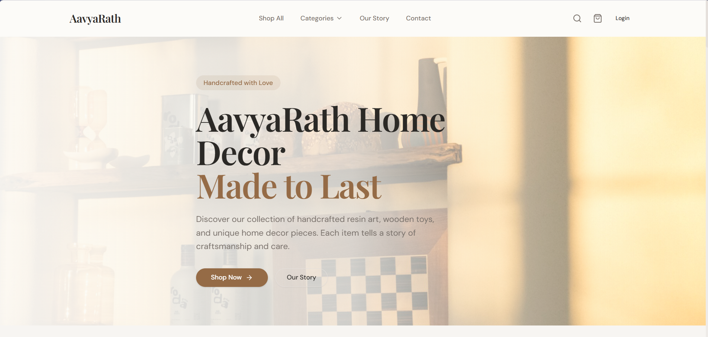
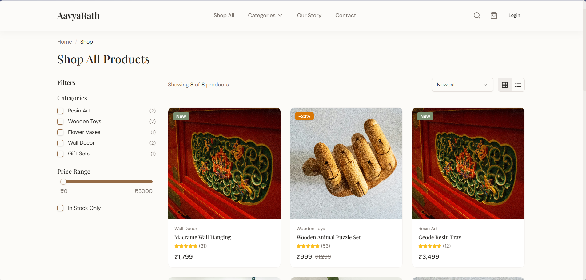
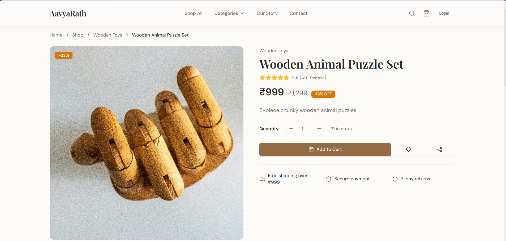
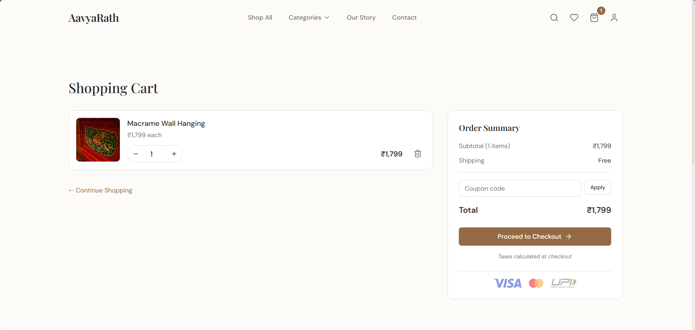
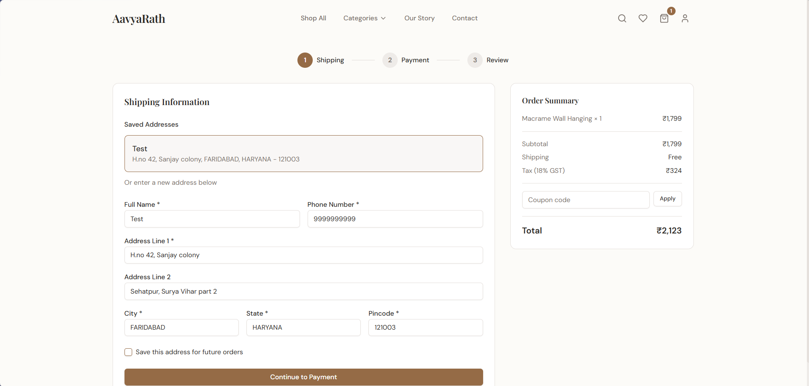
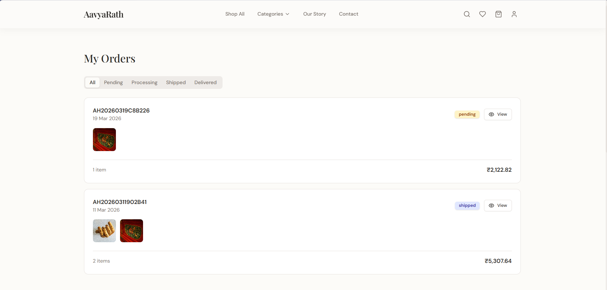
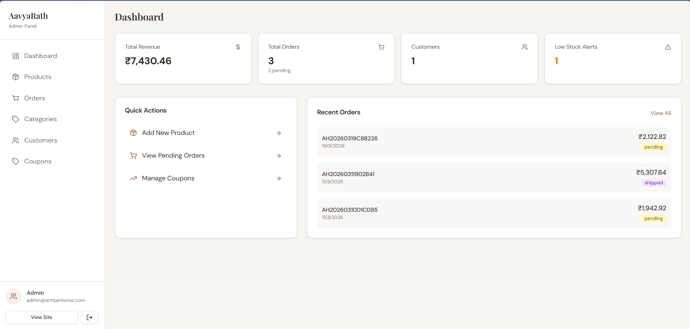
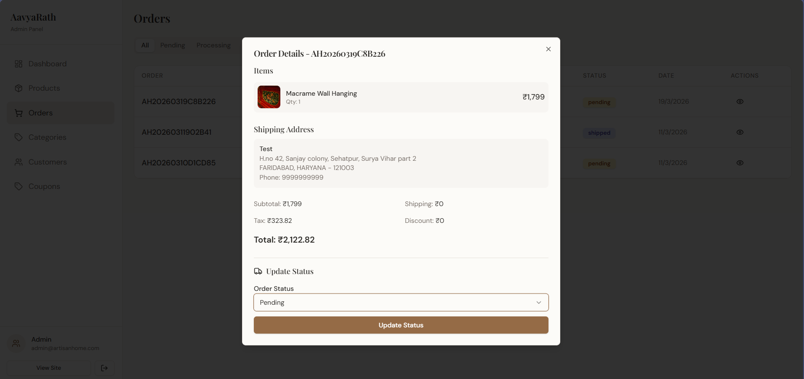
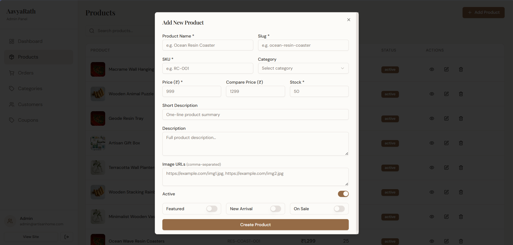

# AavyaRath — Home Decor E-Commerce

> A complete, production-ready Indian artisan home decor marketplace built with React 19, featuring full authentication, cart, Razorpay checkout, order tracking, and a rich admin panel.


---

## Table of Contents

- [Overview](#overview)
- [Screenshots](#screenshots)
- [Features](#features)
- [Tech Stack](#tech-stack)
- [Pages & Routes](#pages--routes)
- [Getting Started](#getting-started)
- [Environment Variables](#environment-variables)
- [Design System](#design-system)
- [Admin Panel](#admin-panel)
- [Project Structure](#project-structure)

---

## Overview

AavyaRath is a fully functional e-commerce platform for handcrafted home decor products — resin art, wooden toys, flower vases, and more. It ships with a customer-facing storefront and a full admin panel, both built on the same React codebase.

**Demo credentials**
| Role | Email | Password |
|------|-------|----------|
| Admin | `admin@artisanhome.com` | `admin123` |

---

## Screenshots

> Replace the placeholders below with actual screenshots of your running application.

### Homepage

*Hero section with category grid, best sellers, and testimonials*

### Shop Page

*Product catalog with sidebar filters, price range slider, sort, and grid/list toggle*

### Product Detail

*Image gallery, specifications, reviews, add to cart, and related products*

### Cart & Checkout
| Cart | Checkout | Order Confirmation |
|------|----------|-------------------|
|  |  |  |

### Admin Panel
| Dashboard | Orders | Products |
|-----------|--------|----------|
|  |  |  |

---

## Features

### Storefront
- **Authentication** — Email/password login, Google OAuth via session callback, JWT tokens, persistent sessions, role-based access (user / admin / superadmin)
- **Product Catalog** — Image gallery, specifications, reviews & ratings, related products
- **Filtering & Search** — Category filter, price range slider, in-stock toggle, multi-sort (newest, price, best-selling, top-rated)
- **Cart** — Persistent cart, quantity management, coupon code validation
- **Checkout** — 3-step flow: Shipping address → Payment method → Review & Place Order
- **Razorpay Payments** — UPI, credit/debit cards, netbanking, Cash on Delivery
- **Order Tracking** — Visual timeline (Placed → Processing → Shipped → Delivered) with tracking number and courier partner
- **Wishlist** — Add/remove from product cards and dedicated wishlist page
- **User Account** — Profile editing, address book, password change, order history

### Admin Panel
- **Dashboard** — Revenue, total orders, customers, low-stock alerts, recent orders
- **Product Management** — Full CRUD: name, slug, SKU, price, compare price, stock, images, flags (Featured / New Arrival / On Sale)
- **Order Management** — Status updates with tracking number and courier partner input
- **Category Management** — Create/edit/delete with auto slug generation
- **Coupon Engine** — Percentage, flat, and free-shipping coupons with validity dates and usage limits
- **Customer Directory** — Search, view details, total orders & spend per customer

---

## Tech Stack

| Layer | Technology |
|-------|------------|
| **Framework** | React 19, React Router v7 |
| **Styling** | Tailwind CSS 3.4, shadcn/ui (New York style) |
| **UI Primitives** | Radix UI (Dialog, Select, Tabs, Accordion, Sheet, etc.) |
| **Icons** | lucide-react |
| **Notifications** | Sonner |
| **HTTP Client** | Axios with request/response interceptors |
| **Payment** | Razorpay Web SDK |
| **Forms** | Controlled components, react-hook-form (select pages) |
| **Carousel** | Embla Carousel |
| **Charts** | Recharts |
| **Build Tool** | Create React App + CRACO (for `@/` path aliases) |
| **Fonts** | Playfair Display (headings), DM Sans (body) via Google Fonts |

---

## Pages & Routes

### Public Routes
| Route | Page | Description |
|-------|------|-------------|
| `/` | Home | Hero, categories, best sellers, brand story, new arrivals, testimonials |
| `/shop` | Shop | Full catalog with filters, sort, search, pagination |
| `/product/:slug` | Product Detail | Gallery, specs, reviews, add to cart, wishlist, share |
| `/category/:slug` | Category | Filtered products with category hero banner |
| `/about` | About | Brand story, craft, values, artisan team |
| `/contact` | Contact | Contact form, map, business info |
| `/faq` | FAQ | Searchable accordion FAQ grouped by category |
| `/track-order/:id?` | Track Order | Order timeline with courier info |
| `/login` | Login | Email/password + Google OAuth |
| `/register` | Register | Account creation with validation |

### Authenticated Routes
| Route | Page | Description |
|-------|------|-------------|
| `/cart` | Cart | Items, quantity, coupon code, checkout CTA |
| `/checkout` | Checkout | 3-step: shipping → payment → review |
| `/order-confirmation/:id` | Confirmation | Order receipt with all details |
| `/account` | Account | Profile, addresses, password (tabs) |
| `/account/orders` | My Orders | Order history with status filter |
| `/account/wishlist` | Wishlist | Saved products grid |

### Admin Routes
| Route | Page | Description |
|-------|------|-------------|
| `/admin/login` | Admin Login | Admin-only login form |
| `/admin/dashboard` | Dashboard | Stats, recent orders, quick actions |
| `/admin/products` | Products | CRUD with search and category filter |
| `/admin/orders` | Orders | Table with status filter, detail dialog |
| `/admin/categories` | Categories | Create/edit/delete categories |
| `/admin/coupons` | Coupons | Create/delete discount coupons |
| `/admin/customers` | Customers | Directory with search and detail dialog |

---

## Getting Started

### Prerequisites
- Node.js 18+
- npm 9+
- A running backend API server

### Installation

**1. Clone the repository**
```bash
git clone https://github.com/your-username/aavyarath.git
cd aavyarath/frontend
```

**2. Install dependencies**
```bash
npm install
```

**3. Configure environment variables**
```bash
cp .env.example .env
# Edit .env with your values
```

**4. Start the development server**
```bash
npm start
# Opens at http://localhost:3000
```

**5. Build for production**
```bash
npm run build
```

> The app automatically seeds sample data (products, categories, admin user) on first load via the `/api/seed` endpoint.

---

## Environment Variables

Create a `.env` file in the project root:

```env
# Backend API base URL (no trailing slash)
REACT_APP_BACKEND_URL=http://localhost:8000

# Razorpay public key ID
REACT_APP_RAZORPAY_KEY_ID=rzp_test_xxxxxxxxxxxx
```

| Variable | Required | Description |
|----------|----------|-------------|
| `REACT_APP_BACKEND_URL` | ✅ Yes | Base URL of your backend API server |
| `REACT_APP_RAZORPAY_KEY_ID` | ✅ Yes | Razorpay public key for payment integration |

> **Important:** The `REACT_APP_` prefix is required for CRACO/CRA to expose variables in the browser bundle. Never commit your `.env` file.

---

## Design System

The project uses a warm, artisan-inspired palette built around earthy terracotta and sage tones. All colors are CSS HSL variables supporting light and dark modes.

### Color Palette

| Token | HSL Value | Usage |
|-------|-----------|-------|
| `--primary` | `28 36% 43%` | Clay brown — buttons, links, accents |
| `--accent` | `100 12% 50%` | Sage green — badges, highlights |
| `--background` | `45 33% 98%` | Warm off-white page background |
| `--secondary` | `30 24% 87%` | Linen — secondary buttons, chips |
| `--foreground` | `30 6% 16%` | Deep ink — body text |
| `--muted-foreground` | `25 6% 45%` | Warm grey — secondary text |

### Typography

| Font | Usage | Weight |
|------|-------|--------|
| **Playfair Display** | All headings (h1–h6) | 400, 600, 700 |
| **DM Sans** | Body text, UI elements | 300, 400, 500, 600 |

### Key Utility Classes

```
.container-custom    max-w-7xl with responsive padding
.section-padding     py-12 md:py-24
.heading-xl          text-5xl md:text-7xl
.heading-lg          text-4xl md:text-5xl
.heading-md          text-2xl md:text-3xl
.product-card        card with hover effects
.btn-primary         rounded-full primary button
.noise-overlay       subtle noise texture overlay
```

---

## Admin Panel

Access the admin panel at `/admin/login`. Requires an account with role `admin` or `superadmin`.

### Product Flags
When creating/editing products, you can set three boolean flags:

| Flag | Effect |
|------|--------|
| **Featured** | Appears in "Best Sellers" section on homepage |
| **New Arrival** | Appears in "New Arrivals" section, shown with "New" badge |
| **On Sale** | Shows sale badge with discount percentage if `compare_at_price` is set |

### Coupon Types

| Type | Description | Example |
|------|-------------|---------|
| `percentage` | Discount by % of cart total | 10% off |
| `flat` | Fixed amount off cart total | ₹100 off |
| `freeshipping` | Waives shipping cost | Free delivery |

### Order Fulfillment Flow

```
pending → processing → shipped → delivered
                           ↑
               (tracking number + courier required)
```

---

## Project Structure

```
src/
├── App.js                  # Routes, AuthContext, CartContext, axios client
├── components/
│   ├── layout/
│   │   ├── Header.jsx      # Sticky header, search, cart badge, user menu
│   │   ├── Footer.jsx      # Newsletter, links, social, payment logos
│   │   └── Layout.jsx      # Page wrapper
│   ├── ProductCard.jsx     # Card with wishlist, quick-add, badges
│   ├── ProductCardSkeleton.jsx
│   └── ui/                 # shadcn/ui components
├── pages/
│   ├── HomePage.jsx
│   ├── ShopPage.jsx
│   ├── ProductPage.jsx
│   ├── CategoryPage.jsx
│   ├── CartPage.jsx
│   ├── CheckoutPage.jsx    # Razorpay integration
│   ├── OrderConfirmationPage.jsx
│   ├── TrackOrderPage.jsx
│   ├── AccountPage.jsx
│   ├── OrdersPage.jsx
│   ├── WishlistPage.jsx
│   ├── LoginPage.jsx
│   ├── RegisterPage.jsx
│   ├── AboutPage.jsx
│   ├── ContactPage.jsx
│   ├── FAQPage.jsx
│   ├── AuthCallback.jsx    # Google OAuth callback handler
│   └── admin/
│       ├── AdminLayout.jsx
│       ├── AdminDashboard.jsx
│       ├── AdminProducts.jsx
│       ├── AdminOrders.jsx
│       ├── AdminCategories.jsx
│       ├── AdminCoupons.jsx
│       └── AdminCustomers.jsx
├── hooks/
│   └── use-toast.js
├── lib/
│   └── utils.js            # cn() helper
├── index.css               # CSS variables, custom utilities, animations
└── index.js
```

---

## License

This project is for educational and personal use. All product images sourced from [Unsplash](https://unsplash.com).

---

*Built with ❤️ for AavyaRath Home Decor· Faridabad, Haryana, India*